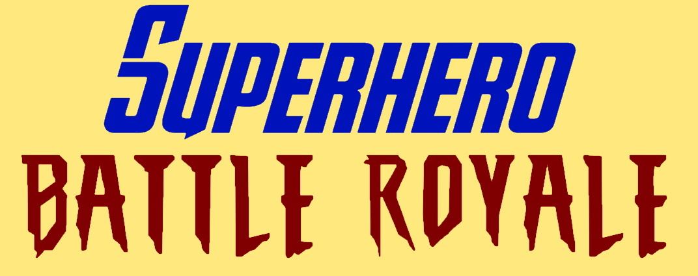
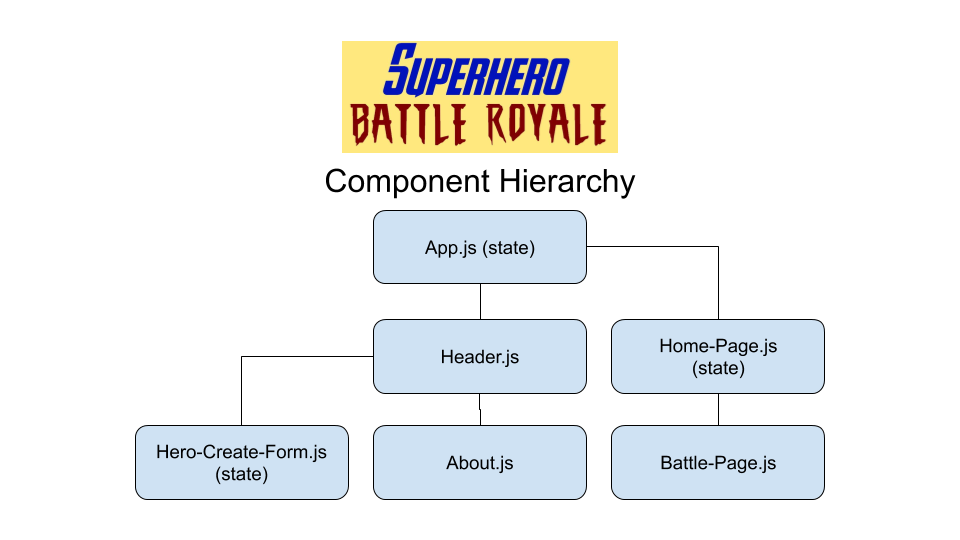
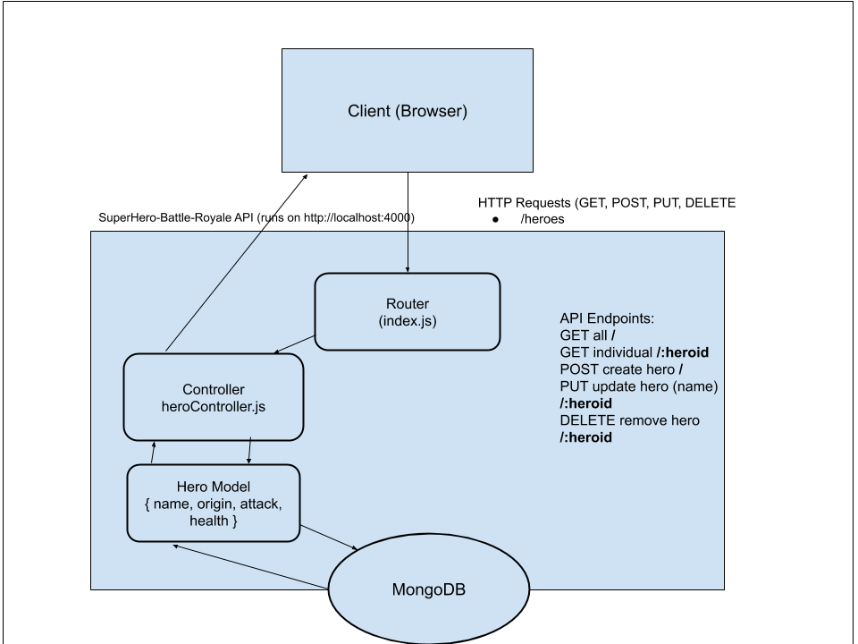
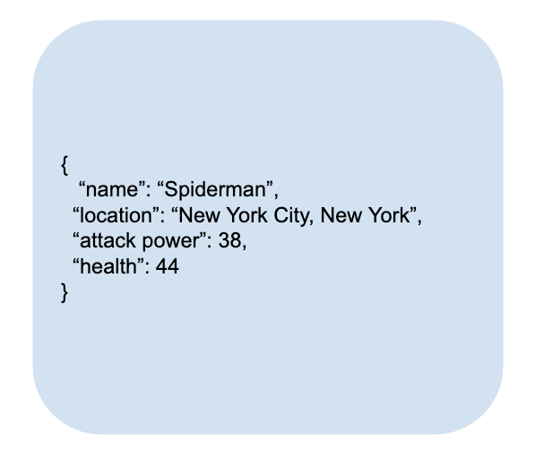

# Superhero Battle Royale App

## Anyl Pascal, Daniel Smith, Dylan Girard, Morgan MacDonald

## Project Description

Ever wondered which superhero, in an all out battle royale, would come out on top? Look no further than this full-stack MERN app!

Create or choose a superhero, select an opponent, then pit the two against one another to see which is stronger in battle. This app uses React/ReactBootstrap for front-end interface design. Our homemade API is built using ExpressJS, and handles our backend routing and functionality.

## Front-End Wireframes

## Component Hierarchy

## Back-End Request-Response Cycle

## JSON Response Example

## User Stories

**Minimum Viable Product Stories**

- As a user, I want be greeted by a slick interface that reminds me of cool comic book heroes, because I love comics.

- As a user, I want to be able to choose from a plethora of heroes from both the Marvel and DC Universes, because they are all awesome.

- As a user, I would like to create my own heroes with unique stats that can also do battle, because I like customization in my games.

- As a user, I would also like to be able to update or delete old custom heroes, because I may want to change or discard them in the future.

- I want to see the results of a fight between any two fighters, because I want to know who's the strongest hero of them all.

**Stretch Goals**

- As a user, I would like to have access to an about page because I want to learn more about the creators of this app.

- As a user, I would like to be able to customize/create my own heroes in more detail using an external hero maker, because I love customization.

- As a user, I would like to be able create a username/password so that my custom heroes are saved to my account, because I want to use them again later on.
